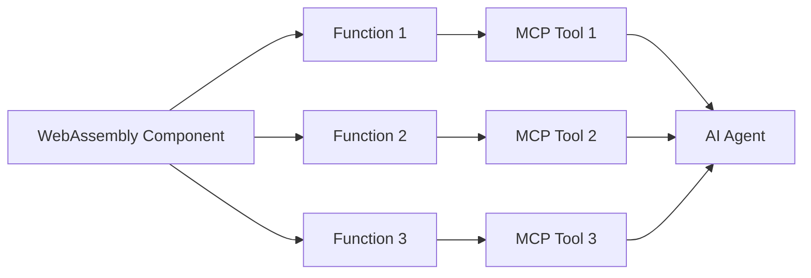
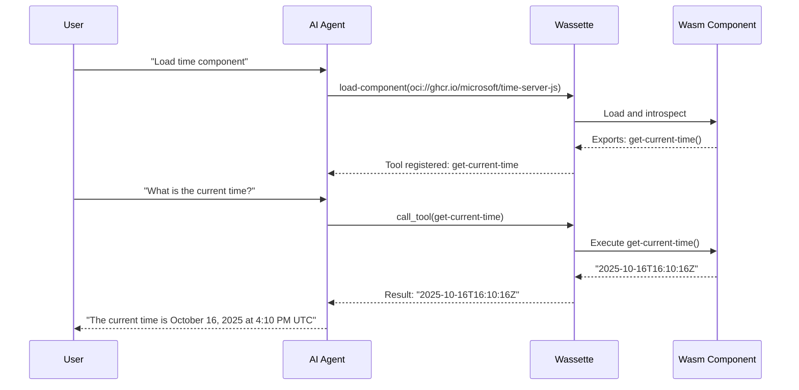

# Core Concepts

This page introduces the fundamental concepts behind Wassette and how it bridges the Model Context Protocol (MCP) with WebAssembly Components.

## Model Context Protocol (MCP)

The Model Context Protocol is a standard protocol that defines how AI agents (like Claude, GitHub Copilot, or Cursor) communicate with external tools and services.

### MCP Components

MCP defines several types of components that servers can provide:

#### MCP Servers vs MCP Clients

- **MCP Clients**: The AI agent applications (VS Code, Claude Code, Cursor, Gemini CLI) that connect to MCP servers and use their capabilities
- **MCP Servers**: Backend services that provide capabilities to AI agents. Wassette is an MCP server.

#### Tools

**Tools** are functions that AI agents can call to perform actions or retrieve information. For example:
- A weather tool that fetches current weather data
- A file system tool that reads or writes files
- A calculation tool that performs mathematical operations

Wassette primarily focuses on **tools** by translating WebAssembly component functions into MCP tools.

#### Prompts (Not Yet Supported)

**Prompts** are reusable templates that help structure conversations with AI agents. These provide standardized ways to interact with certain types of data or workflows.

> **Note**: Wassette does not currently support MCP prompts.

#### Resources (Not Yet Supported)

**Resources** are data sources that can be read by AI agents, such as files, database entries, or API endpoints. Resources allow agents to access contextual information without requiring explicit tool calls.

> **Note**: Wassette does not currently support MCP resources.

## WebAssembly Component Model

WebAssembly (Wasm) is a portable binary instruction format that runs in a sandboxed environment. The **WebAssembly Component Model** extends basic Wasm with standardized interfaces for building composable, reusable components.

### Key Concepts

#### Components

A **component** is a self-contained WebAssembly module with a well-defined interface. Think of components as portable, language-agnostic libraries that can run securely anywhere.

Key characteristics:
- **Language-agnostic**: Write in JavaScript, Python, Rust, Go, or any language that compiles to Wasm
- **Portable**: Run on any platform with a Wasm runtime
- **Sandboxed**: Isolated execution environment with no access to host resources by default
- **Composable**: Components can import and export interfaces to work together

#### WIT (WebAssembly Interface Types)

**WIT** is an Interface Definition Language (IDL) that describes how components interact with each other and with the host environment.

Example WIT interface:
```wit
package example:weather;

interface weather-api {
    /// Get current weather for a location
    get-weather: func(location: string) -> result<string, string>;
}

world weather-component {
    export weather-api;
}
```

This defines:
- A `package` namespace for the component
- An `interface` with functions and their types
- A `world` that declares what the component exports

#### Bindings

**Bindings** are the language-specific code that connects your source code to the WIT interface. The WebAssembly tooling automatically generates these bindings, so you can write code in your preferred language while maintaining the standard Wasm interface.

For example:
- In JavaScript: Use `jco` to generate TypeScript bindings
- In Python: Use `componentize-py` to generate Python bindings
- In Rust: Use `wit-bindgen` to generate Rust bindings

## How Wassette Translates Components to MCP Tools

Wassette acts as a bridge between WebAssembly Components and the Model Context Protocol. Here's how it works:

### One Component, Multiple Tools

Each WebAssembly component can export multiple functions, and Wassette translates each exported function into an individual MCP tool. This is different from traditional MCP servers where one server typically provides a fixed set of tools.



### Dynamic Tool Registration

When you load a component in Wassette:

1. **Component Loading**: Wassette loads the WebAssembly component using the Wasmtime runtime
2. **Interface Introspection**: Wassette examines the component's WIT interface to discover exported functions
3. **Schema Generation**: Each function's parameters and return types are converted to JSON Schema
4. **Tool Registration**: Each function becomes an MCP tool with a name, description, and parameter schema
5. **Runtime Execution**: When the AI agent calls a tool, Wassette executes the corresponding function in the sandboxed Wasm environment

### Example Flow



### Function Naming

Wassette converts WIT interface names into tool names by replacing colons and slashes with underscores. For example:
- WIT: `example:weather/weather-api#get-weather`
- Tool name: `example_weather_weather_api_get_weather`

## Policy and Capability Model

Wassette's security model is built on the principle of **least privilege**: components have no access to system resources by default and must be explicitly granted permissions.

### Capability-Based Security

Instead of running with the same privileges as the host process, WebAssembly components in Wassette operate under a capability-based security model:

- **Deny by default**: No file system, network, or environment variable access without explicit grants
- **Fine-grained control**: Permissions are granted per-component and per-resource
- **Runtime enforcement**: The Wasm sandbox enforces all security policies
- **Auditable**: All permission grants are tracked and can be reviewed

### Permission Types

#### File System Permissions

Control read and write access to files and directories:

```yaml
storage:
  allow:
    - uri: "fs:///workspace/data"
      access: ["read", "write"]
    - uri: "fs:///etc/config.yaml"
      access: ["read"]
```

#### Network Permissions

Control outbound network access to specific hosts:

```yaml
network:
  allow:
    - host: "api.weather.com"
    - host: "api.openai.com"
```

#### Environment Variable Permissions

Control access to environment variables:

```yaml
environment:
  allow:
    - key: "API_KEY"
    - key: "HOME"
```

#### Resource Limits (Future)

Future versions will support resource limits such as:
- Maximum memory allocation
- CPU time limits
- Maximum execution time

### Permission Management

Permissions can be managed in several ways:

1. **Policy Files**: YAML files that define component permissions
2. **Built-in Tools**: MCP tools like `grant-storage-permission` and `grant-network-permission`
3. **CLI Commands**: Direct management via `wassette permission grant` commands
4. **AI Agent Requests**: Natural language requests to your agent (e.g., "Grant this component read access to the workspace")

### Security Boundaries

Wassette provides multiple layers of security:

```
┌─────────────────────────────────────┐
│         Host System                 │
│  ┌───────────────────────────────┐  │
│  │   Wassette MCP Server         │  │
│  │  ┌─────────────────────────┐  │  │
│  │  │  Wasmtime Runtime       │  │  │
│  │  │  ┌───────────────────┐  │  │  │
│  │  │  │ Wasm Component    │  │  │  │
│  │  │  │ (Sandboxed)       │  │  │  │
│  │  │  └───────────────────┘  │  │  │
│  │  │  Policy Engine          │  │  │
│  │  └─────────────────────────┘  │  │
│  └───────────────────────────────┘  │
└─────────────────────────────────────┘
```

1. **Wasm Sandbox**: Memory isolation, type safety, no direct system access
2. **Wasmtime Runtime**: Enforces WASI (WebAssembly System Interface) capabilities
3. **Policy Engine**: Applies fine-grained permission checks
4. **Wassette Server**: Manages component lifecycle and MCP protocol

### Benefits of This Architecture

- **Defense in Depth**: Multiple security layers protect against vulnerabilities
- **Minimal Attack Surface**: Components cannot access unauthorized resources
- **Transparent Security**: Permissions are explicit and auditable
- **Isolated Execution**: Components cannot interfere with each other
- **Cross-Platform**: Same security guarantees on Linux, macOS, and Windows

## Next Steps

Now that you understand the core concepts behind Wassette:

- **[Installation](./installation.md)**: Install Wassette on your system
- **[MCP Clients](./mcp-clients.md)**: Set up Wassette with your AI agent
- **[Managing Permissions](./reference/permissions.md)**: Learn how to grant and revoke permissions
- **[Building Components](./cookbook/README.md)**: Create your own WebAssembly components
- **[Architecture](./design/architecture.md)**: Dive deeper into Wassette's technical design

## Additional Resources

- [Model Context Protocol Specification](https://spec.modelcontextprotocol.io/)
- [WebAssembly Component Model](https://component-model.bytecodealliance.org/)
- [WIT Specification](https://github.com/WebAssembly/component-model/blob/main/design/mvp/WIT.md)
- [WASI Preview 2](https://github.com/WebAssembly/WASI)
- [Wasmtime Security](https://docs.wasmtime.dev/security.html)
