```mermaid
sequenceDiagram
    participant Client as MCP Client
    participant Server as Wassette MCP Server
    participant LM as LifecycleManager
    participant Engine as Wasmtime Engine
    participant Registry as Component Registry
    participant Policy as Policy Engine
    
    Client->>Server: load-component(path)
    Server->>LM: load_component(uri)
    
    alt OCI Registry
        LM->>LM: Download from OCI
    else Local File
        LM->>LM: Load from filesystem
    else HTTP URL
        LM->>LM: Download from URL
    end
    
    LM->>LM: Inspect root name and artifact kind
    Note over LM: Only ordinary tool candidates enter this runtime
    LM->>Engine: Create Component
    Engine->>Engine: Compile WebAssembly
    Engine->>Engine: Extract WIT Interface
    
    LM->>Registry: Register Component
    Registry->>Registry: Generate JSON Schema
    Registry->>Registry: Map Tools to Component
    
    LM->>Policy: Apply Default Policy
    Policy->>Policy: Create WASI State Template
    
    LM-->>Server: Component ID + LoadResult
    Server-->>Client: Success with ID
    
    Note over Client,Policy: Component is now loaded and ready
    
    Client->>Server: call_tool(tool_name, args)
    Server->>LM: execute_component_call(id, func, params)
    
    LM->>Policy: Get WASI State for Component
    Policy->>Policy: Apply Security Policy
    Policy->>Engine: Create Store with WASI Context
    
    LM->>Engine: Instantiate Component
    Engine->>Engine: Call Function with Args
    Engine->>Engine: Execute in Sandbox
    
    Engine-->>LM: Results
    LM-->>Server: JSON Response
    Server-->>Client: Tool Result
```

## Component names, storage keys, and runtime kinds

`wassette::inspect_artifact` reads binary metadata without compiling. It returns
the explicit root component name, if present, separately from the artifact's
shape: an ordinary tool candidate, ACP provider, ACP layer, or unsupported
artifact. Only root `component-name` metadata supplies semantic `ComponentId`;
filenames, nested module names, and names synthesized by WIT decoders do not.
Names preserve their exact spelling and are declarations, not proof of origin.

`StorageKey` validates portable filesystem stems and reports collision keys for
case-insensitive artifact paths and the existing secrets filename projection.
It neither generates semantic names nor grants permission to replace a component.
New keys reject nonportable spelling, Windows device names, trailing dots, and
unsafe projected secret filenames instead of silently renaming them.

First-party build recipes embed the explicit names declared in
`scripts/component-names.json` before hashing or publishing their outputs.
Nested metadata is preserved; opaque third-party downloads are not renamed.
See [producer naming](../development/getting-started.md#declaring-first-party-component-names).

Existing load results, selectors, policy, and secrets lookups still use storage
keys. Semantic-only lookup is not enabled: it requires a persisted
semantic-name-to-storage-key mapping adopted by every adapter. Existing secret
paths are unchanged.

The ordinary runtime inspects current Wasm bytes before eager or lazy compilation,
native-cache loading, and cached tool/schema publication. ACP providers/layers
and non-runnable shapes cannot become MCP tools through stale metadata.
ACP applies its own stage/version checks before compiling with its async engine.
Classification does not validate imports, promise compatibility, or authorize
execution; those remain the selected runtime's responsibilities.

Ordinary cache freshness rules are unchanged. Inspection does not provide a
cross-process snapshot, transactional replacement, or automatic invalidation of
an already loaded instance when another process changes its file.