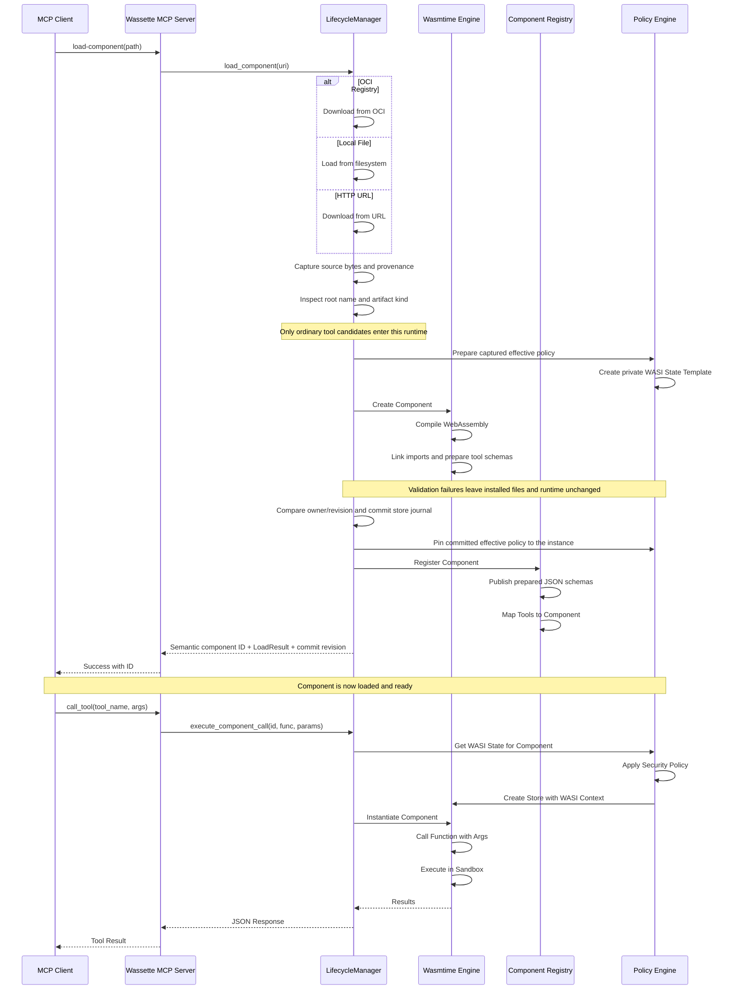

## Transactional installation and replacement

`load_component` captures the incoming Wasm and any policy supplied by the
existing acquisition path before changing installed files. It inspects and
compiles those bytes directly, links imports, prepares schemas, and validates the
effective policy without publishing runtime state or caches. An old `.cwasm`
cannot validate a replacement. Invalid Wasm, unsupported imports, invalid or
unreadable policy, and private staging failures leave the installed component,
policy, caches, and loaded tools unchanged.

An unbundled replacement retains the effective policy and attachment metadata.
Explicit attachments and permission edits also take precedence over incoming
bundled policies, including an explicit policy clear. This conservative
precedence is an intentional behavior change: use an explicit policy operation
or a manifest override to change operator-selected grants. Ordinary local loads
do not discover adjacent policies; ACP acquisition retains that behavior.
All paths preserve the supplied HTTP/OCI clients, environment and secrets
directory.

`acquisition::acquire_component` captures inputs without installing or choosing a
runtime. It replaces the former `loader::fetch_component*` and
`promote_component_artifact` publication APIs. `ComponentStore::commit_install`
requires a `PreparedInstall` validated against the exact Wasm and effective
policy. Ordinary loads compile, link and prepare schemas; ACP compiles and checks
the exported stage and protocol version with its own engine. ACP evidence does
not promise complete host linking: remaining link failures are selection errors.
Installation alone neither exposes tools nor starts an ACP agent.
Ordinary startup, cache hydration and restoration require `ExposeTools` intent.
An `InstallOnly` receipt stays unexposed even with a valid tool cache or after a
policy edit; an explicit ordinary load can commit the exposure intent.

The store retains the flat artifact layout:

```text
<storage-key>.wasm
<storage-key>.policy.yaml
<storage-key>.policy.meta.json
<storage-key>.install.json
.store.lock
.store-state.json
.transactions/<operation>/
.active-transaction
```

Receipts separate semantic identity, private storage key, stable source, owner,
acquisition evidence and deployment intent. They bind the Wasm hash and effective
policy, including policy provenance and attachment metadata. An OCI manifest
digest is not the Wasm byte hash; unresolved versions/digests remain unknown.
Every authoritative change, including a policy-only edit, advances a persistent
store cursor and entry revision.

All cooperating readers and writers use the same filesystem lock and journal.
Private staging precedes the exclusive commit lock; owner/source/revision checks
are repeated under it. The durable store head is replaced last. Recovery restores
the complete old image before that decision or finishes the new image afterward.
Several renames are **not** independently an atomic bundle. Snapshot readers pin
the coherent file set before releasing the shared lock; compilation and execution
never reopen mutable live artifact or policy paths.

The lock order is per-component guard, store lock, then a bounded in-memory
try-lock. Network access, compilation, permission prompts and guest execution
hold no store lock. `checked_read` checks the global cursor and optional entry
revision while admitting a prepared in-memory swap; it cannot cross an await.
Transaction workers retain recovery material across request cancellation.
Disk commitment and runtime publication remain separate outcomes: a subsequent
conflict is reported as committed-to-disk but requiring a runtime retry, not a
rollback. Existing calls retain their captured inputs.

Caches are derived, revision/hash/engine/schema-bound and conditionally published.
Stale compilation cannot overwrite a new installation or resurrect a removal.
Invalidating a cache never deletes installed Wasm. Cache failures are logged and
can require rebuilding. `snapshot_if_changed(None)` always returns full inventory;
a known cursor detects changes from other processes without relying on an
in-process notification. General catalog refresh and protocol update feeds are
separate runtime responsibilities, not a filesystem watcher in this layer.

Explicit uninstall records a retired reservation and preserves secrets.
Managed-source cleanup additionally compares exact ownership and revision, so
it cannot prune a later explicit adoption. Retirement retains the previous
owner and source observation; local discovery decides whether reappearance
should be suppressed. Reinstall cannot transfer a name, storage slot or secrets
to a different source.
If a retired entry previously had a nonempty explicit policy, reinstall must
supply that policy or deliberately select a new explicit policy; a new bundle
does not silently inherit or replace its grants.

The protocol requires cooperating binaries on a local filesystem with advisory
locks, same-filesystem replacement, hard links and suitable durability barriers.
It provides process-crash recovery; power-loss durability is platform-dependent.
Windows sharing/directory-sync behavior and network filesystems are not claimed
as validated. Read-only stores or unavailable coordination/recovery fail
explicitly. Old binaries and direct edits to authoritative live files are outside
the protocol. Abandoned staging is diagnosed, not deleted based on age.

## Component names, storage keys, and runtime kinds

`wassette::inspect_artifact` reads binary metadata without compiling. It returns
the explicit root component name, if present, separately from the artifact's
shape: an ordinary tool candidate, ACP provider, ACP layer, or unsupported
artifact. Only root `component-name` metadata supplies semantic `ComponentId`;
filenames, nested module names, and names synthesized by WIT decoders do not.
Names preserve their exact spelling and are declarations, not proof of origin.

`StorageKey` validates portable filesystem stems and reports collision keys for
case-insensitive artifact paths and the existing secrets filename projection.
It neither generates semantic names nor grants permission to replace a component.
New keys reject nonportable spelling, Windows device names, trailing dots, and
unsafe projected secret filenames instead of silently renaming them.

First-party build recipes embed the explicit names declared in
`scripts/component-names.json` before hashing or publishing their outputs.
Nested metadata is preserved; opaque third-party downloads are not renamed.
See [producer naming](../development/getting-started.md#declaring-first-party-component-names).

Load results and component, policy, secret and ACP selectors use the exact
embedded semantic name. Receipts map it to the private storage key; semantic
names are never sanitized into filenames. Existing physical policy and secret
keys are retained, with no automatic secret rekeying. The shared secrets
directory independently reserves semantic/source/key associations; unknown
secret files cannot be adopted by a new component.

This is a compatibility boundary. Producer artifacts must declare an
unambiguous root component name. Unreceipted files remain protected legacy
inventory, not runnable filename aliases or automatically prunable managed
entries. There is no automatic legacy or secret migration. First-party build
recipes provide producer names; tests can give isolated copies their own fixture
names without rewriting producer outputs.

Local sources bind to the canonical source path; HTTPS sources bind to the
normalized request (query redacted in receipts, but significant through its
hash); OCI sources bind to the canonical repository. These are conservative
continuity rules, not source authentication. Moving a file or changing a signed
URL can therefore conflict even when its embedded name is unchanged.

The ordinary runtime inspects current Wasm bytes before eager or lazy compilation,
native-cache loading, and cached tool/schema publication. ACP providers/layers
and non-runnable shapes cannot become MCP tools through stale metadata.
ACP applies its own stage/version checks before compiling with its async engine.
Classification does not validate imports, promise compatibility, or authorize
execution; those remain the selected runtime's responsibilities.

Lazy restoration reads the current receipt and replaces a stale runtime revision
from one coherent snapshot. It does not add a background cross-process catalog
refresh driver or promise immediate tool-list notifications.