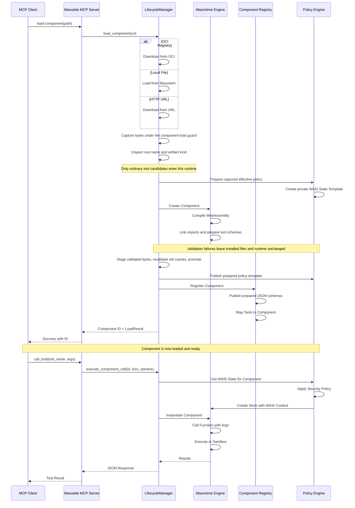

## Safe explicit replacement

`load_component` captures the incoming Wasm and any policy supplied by the
existing acquisition path before changing installed files. It inspects and
compiles those bytes directly, links imports, prepares schemas, and validates the
effective policy without publishing runtime state or caches. An old `.cwasm`
cannot validate a replacement. Invalid Wasm, unsupported imports, invalid or
unreadable policy, and private staging failures leave the installed component,
policy, caches, and loaded tools unchanged.

An unbundled replacement retains an attached policy and its metadata. Existing
OCI bundles still supply their policy; local files do not automatically acquire
sibling-policy discovery. Loading the installed Wasm path itself works by
capturing its bytes first. HTTP/OCI clients, environment, and the configured
secrets directory are preserved. These guarantees apply to components admitted
by the inspection and storage-key rules below; this change does not implement
semantic-only lookup or ownership enforcement.

Promotion uses destination-filesystem staging and the existing per-component
guard. Old derived caches are invalidated only after preparation and staging
succeed, without deleting the installed Wasm. A handled promotion failure may
leave caches absent and attempts to restore the previous policy; a rollback
failure is reported explicitly. Successful loads reuse the compiled instance.
Optional cache-write failures are logged, and native caches are published as
complete files.

Once publication starts, its worker owns the stage and guard even if the
request is cancelled. Cancellation before publication discards private work.
This is process-local serialization, **not a cross-process snapshot or a
crash-atomic multi-file transaction**. Independent managers, direct policy or
filesystem writers, and in-flight calls do not participate in the load guard;
disk and runtime publication are not one atomic operation.

## Component names, storage keys, and runtime kinds

`wassette::inspect_artifact` reads binary metadata without compiling. It returns
the explicit root component name, if present, separately from the artifact's
shape: an ordinary tool candidate, ACP provider, ACP layer, or unsupported
artifact. Only root `component-name` metadata supplies semantic `ComponentId`;
filenames, nested module names, and names synthesized by WIT decoders do not.
Names preserve their exact spelling and are declarations, not proof of origin.

`StorageKey` validates portable filesystem stems and reports collision keys for
case-insensitive artifact paths and the existing secrets filename projection.
It neither generates semantic names nor grants permission to replace a component.
New keys reject nonportable spelling, Windows device names, trailing dots, and
unsafe projected secret filenames instead of silently renaming them.

First-party build recipes embed the explicit names declared in
`scripts/component-names.json` before hashing or publishing their outputs.
Nested metadata is preserved; opaque third-party downloads are not renamed.
See [producer naming](../development/getting-started.md#declaring-first-party-component-names).

Existing load results, selectors, policy, and secrets lookups still use storage
keys. Semantic-only lookup is not enabled: it requires a persisted
semantic-name-to-storage-key mapping adopted by every adapter. Existing secret
paths are unchanged.

The ordinary runtime inspects current Wasm bytes before eager or lazy compilation,
native-cache loading, and cached tool/schema publication. ACP providers/layers
and non-runnable shapes cannot become MCP tools through stale metadata.
ACP applies its own stage/version checks before compiling with its async engine.
Classification does not validate imports, promise compatibility, or authorize
execution; those remain the selected runtime's responsibilities.

Ordinary cache freshness rules are unchanged. Inspection does not provide a
cross-process snapshot, transactional replacement, or automatic invalidation of
an already loaded instance when another process changes its file.