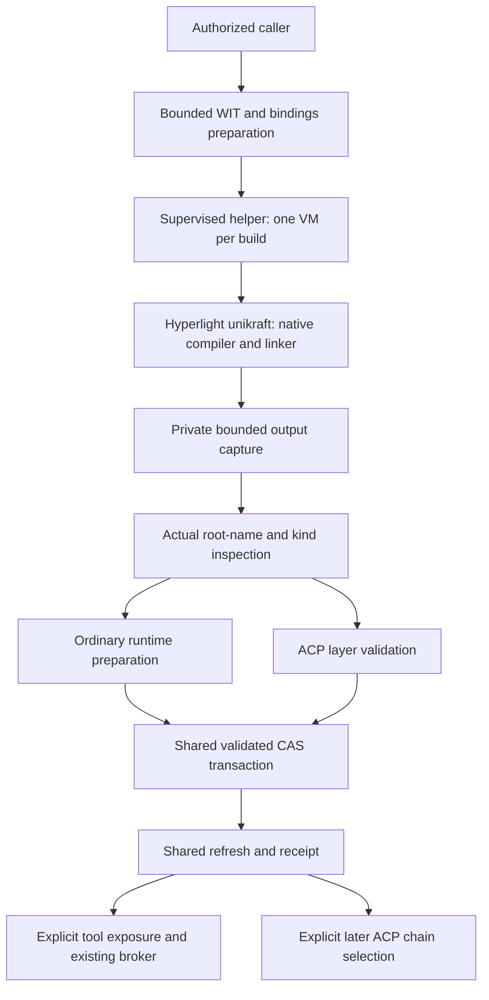

# Sandboxed component generation

> **Status: experimental, opt-in implementation.** The `component-generation`
> Cargo feature and an explicit trusted operator profile are both required.
> See the [CLI](../reference/cli.md#wassette-component-build-opt-in),
> [management tool](../reference/built-in-tools.md#build-component-opt-in), and
> [operator configuration](../reference/configuration-files.md) for the
> implemented interface. Image distribution, additional languages and stronger
> execution isolation remain future work; this is not a general security proof.

## Summary

Wassette can generate WebAssembly components from Rust source and a WIT
world, with the native compiler and linker running inside a Hyperlight VM.
Wassette captures the output, validates it with the appropriate runtime,
and commits it through the existing component store.

```text
source + WIT + actual component name + requested kind
  -> bounded host bindings generation
  -> Hyperlight VM: native rustc, then native component linker
  -> private output capture and producer metadata
  -> identity/kind inspection and matching-runtime validation
  -> validated store transaction and receipt
  -> catalog refresh
       ordinary tool: explicitly requested exposure and invocation
       ACP layer: explicit selection at a later chain start
```

Any caller may request generation, subject to explicit capabilities and
permissions. Outputs are **ordinary tool components or ACP layers**, not
ACP providers. Installed components do not execute in Hyperlight: tools
use Wassette's ordinary Wasmtime runtime, and layers use its ACP runtime.

The [Hyperlight sandbox review](./hyperagent-sandbox-review.md) records
the prior art, published-version research and dated compiler experiment
behind this choice.

## Scope

The initial language is Rust, with std-only user source, host-generated
`wit-bindgen` bindings and inline runtime support. Requests do not run
Cargo, resolve third-party crates, execute proc macros or `build.rs`, or
access a network. The build profile fixes the toolchain and compiler
arguments; a request cannot supply a shell command or linker.

If the required hypervisor, supported platform or signed helper is
unavailable, generation fails clearly. There is **no host-rustc fallback**.
Even without Cargo, file inclusion, macro expansion, constant evaluation
and compiler bugs make native compilation an untrusted-input boundary.

Later work may add curated application crates, JavaScript, Python, Cargo
or a PIE-compatible C/C++ toolchain. Running generated components under
Hyperlight, signed provenance and automatic source publication are
separate proposals.

## Request and result

The following summarizes the conceptual contracts, not the literal JSON schema.
The implemented request nests the source/WIT inputs under `build`, uses
`Tool` or `AcpLayer`, and selects a new or revision-checked target separately.
The reference pages above provide the exact JSON and operator flags.

```text
BuildRequest {
  language: Rust,
  kind: Tool | AcpLayer,
  component_name: string,
  source: bounded UTF-8 string,
  wit: bounded UTF-8 string,
  world: string,
  target:
    New |
    Rebuild { generated_source_ref, expected_entry_revision },
  install_intent: InstallOnly | ExposeTools
}

BuildCompletion {
  build_id,
  bounded_diagnostics,
  commit: CommitOutcome,
  refresh: RefreshReport,
  disposition:
    InstalledOnly |
    ToolExposure { mcp, acp_session } |
    AcpLayerAwaitingSelection
}
```

`component_name` is an explicit producer declaration, not an identity
override for installation. A WIT package and the actual component name
may differ. For example, an author may declare the component name
`example:calculator` while selecting this world:

```wit
package example:arithmetic;

world tool {
    export add: func(a: s32, b: s32) -> s32;
}
```

The host supplies the binding module/runtime contract that the source
implements. WIT dependencies come from captured input and shipped,
version-pinned packages, not network resolution.

An ACP layer request targets the installed ACP implementation's `layer`
world, including its agent and client interfaces. The implementation uses `wit-bindgen` 0.62's inline async runtime support.
Both ordinary tools and the canonical ACP layer have been compiled through
the actual helper in implementation checks. The earlier arithmetic-component
experiment remains dated evidence; it did not establish the layer result.

`AcpLayer + ExposeTools` is invalid. The actual output must match the
requested kind. Provider-shaped or unsupported output fails rather than
falling back to ordinary-tool validation.

The host, not the caller, determines the builder image, resource budget,
caller identity, source ownership, private storage key and effective
policy. Knowing a source reference or requesting exposure is not
authorization.

## Trust boundaries



| Boundary | Responsibility |
| --- | --- |
| Host before compilation | Validate bounded source/WIT input; resolve only shipped dependencies; generate bindings and the inline runtime; authorize the exact request/profile. |
| Compiler VM | Compile and link native toolchain inputs. No host secrets, live store, project tree, management imports or guest networking. |
| Host after compilation | Capture untrusted output, emit producer metadata, inspect and validate the exact finalized bytes, and select the effective policy. |
| Component store | Compare semantic/source/key/owner/revision evidence, then atomically commit through its existing transaction and recovery protocol. |
| Runtime and protocol adapters | Refresh eligible catalogs, apply explicit exposure/selection and authorization, and invoke through existing admission rules. |

Host parsing, bindings generation, metadata emission and Wasmtime
validation still process untrusted inputs. Calling a transform "pure" does
not make it infallible or establish a hard CPU deadline. Bound input and
output complexity, contain worker failures, and use a killable worker
where a hard deadline is required. Do not hold a store lock during any of
these operations.

## Identity, naming and provenance

Keep these identifiers distinct:

| Identifier | Meaning |
| --- | --- |
| `ComponentId` | Exact semantic name declared by one actual root `component-name` entry in the finalized Wasm. |
| `StorageKey` | Private portable key for artifact, policy and cache paths, resolved through the store mapping. |
| Generated-source identity | Stable host-issued identity for an authorized series of rebuilds. Neither a name nor a content digest. |
| Remote `PackageId` | Registry/repository identity for remote component acquisition; not the identity of a generated artifact or its builder image. |
| Wasm digest | Digest of the finalized bytes that are validated and committed. |
| Builder manifest digest | Immutable identity of the selected builder OCI image, separate from the Wasm digest. |
| `EntryRevision` | Opaque store token for authoritative artifact, policy, ownership and provenance state; not a tag or hash. |

### Producer-controlled name

The generation pipeline is a producer, so it can emit the author's actual
component name using standard root metadata. Do this before final hashing
and validation. Retain one matching declaration if already present;
reject conflicting or duplicate declarations rather than overwriting
them to conceal ambiguity.

The final artifact must pass the shared inspector. Missing, invalid or
ambiguous names fail. Nested module/component names, filenames, WIT
exports, directory records, package identities and decoder-generated
names are not substitutes. A literal `root:component` is not a forbidden
spelling if actually declared; a decoder synthesizing it is not evidence.

Preserve semantic spelling, including `:` or `/`. Never sanitize a
semantic name into a filename or secret key. This producer step does not
authorize stamping names into opaque downloads or existing unnamed
artifacts.

First-party producer naming belongs to the identity foundation, including
[the work in #837](https://github.com/microsoft/wassette/pull/837).
Generation consumes that convention for fixtures and implements naming
for its own newly produced outputs, not a second identity parser.

### Authorized rebuilds

`SourceIdentity::Generated { id }` records a lineage whose `id` is minted by
the host and persisted in the existing installed or retired receipt.
It is a non-secret identifier, not a bearer credential. CLI/MCP use explicit
operator ceilings, ACP uses bound-session approval, and ordinary component
callers require revision-bound grants in trusted operator configuration.

New sources receive a validated `generated_<opaque-id>` private key
independent of their semantic name.
Rebuilds keep the existing mapped key and secret association. They require
the same exact semantic identity, admitted source and expected revision.

The host binds installation approval to the captured source/WIT,
builder profile, inspected output and selected policy. If an uninstall,
policy edit, ownership change or replacement happens while a build or
permission prompt is pending, commit fails with a conflict. Do not
silently retry against a newer revision.

An unrelated source cannot claim an installed name, key or secret alias,
even after uninstall. Reinstallation compares the retained retirement
revision and reservation, not an assumed absence. Names and equal bytes
do not establish source authenticity.

### Generation evidence

Add bounded typed generation evidence to the existing `OriginEvidence`,
not a second receipt or provenance database:

- Source/WIT digests, world, requested role and declared name.
- Compiler, linker, bindgen and inline-runtime/profile identities.
- Builder platform, immutable image manifest and initrd digest.
- The complete admitted-input identity and final Wasm digest.

For generated acquisition, a proposed non-fetchable location is
`generated://<host-issued-id>`. Remote component version/pull fields stay
absent. In particular, the builder digest does not occupy the component
acquisition `manifest_digest` field.

Host observations supply this evidence. An untrusted guest result file
cannot attest which image or validator ran. Digests are neither signed
attestations nor a confidentiality or reproducibility guarantee.

Do not store source, diagnostics, credentials, secret values or their
hashes in receipts. Keep attempt timestamps and job IDs out of
authoritative receipt equality so identical builds can remain genuine
no-ops. Generated receipts use schema 2; existing receipts retain schema 1 and their
original source serialization and secret bindings. Older readers reject the
new source/schema rather than inferring an identity or ignoring evidence.
Upgrade cooperating binaries before sharing a store containing generated
receipts with them.

## One installation path

Replace "write into the managed directory, then load its file" with:

1. Capture finalized builder output privately.
2. Inspect the actual bytes for semantic identity and kind.
3. Select effective policy from a coherent store observation.
4. Prepare with the matching runtime, without publishing.
5. Commit the existing `PreparedInstall` against its store-issued
   `ExpectedEntry`.
6. Consume the actual `CommitOutcome` and refresh through the shared
   revision-safe catalog.
7. Apply only explicitly requested, authorized exposure or selection.

Ordinary preparation includes compilation, link/pre-instantiation,
schema and effective-policy preparation. ACP layer validation uses
the ACP engine and its role/export/world/version/policy checks.
`AcpCompiledAndExportChecked` does **not** claim full host-link
validation; those remaining checks happen at explicit chain selection.
No validation step executes generated guest functions.

A host without the matching validator reports that limitation and
commits nothing. An install-only intent does not make an unvalidated
component admissible.

Use the existing `ComponentStore::{observe, read, snapshot_if_changed,
commit_install, update_policy, remove, checked_read, publish_cache,
read_cache}` contracts. `ArtifactSnapshot` owns coherent receipt, Wasm,
effective-policy and cursor data. `CommitOutcome` carries the entry,
cursor and optional actual change, including for a no-op.

Only narrow additions are needed: generated-source/evidence support and
captured-input adapters to the ordinary and ACP preparation paths.
Keep ordinary URI installation as a consumer of the same implementation.
Do not reconstruct removed raw fetch/promotion or independent policy
writers, and do not copy output to a file URI merely to reacquire it.

`checked_read` returns a non-Send scope for bounded synchronous
try-lock/clone/swap operations. It cannot cover compilation, permission
waits, awaits or guest execution. Preparation and commit workers retain
ownership of captured bytes and staging throughout their actual work.

Build, output-validation or pre-commit cancellation failures leave the
last-good artifact, policy, caches and runtime unchanged. Once a store
commit is accepted, cancellation follows the store's completion/recovery
rules; it is not a rollback guarantee.

## Policy, exposure and invocation

Keep four permissions separate: **build**, **install/update**,
**expose/select**, and **invoke**.

For a genuinely new source, the implementation selects absent policy with
the existing runtime's `Default` provenance. It does not supply new grants
or replace operator configuration. Absent policy, empty YAML and "deny all"
are not interchangeable across runtimes; subsequent permission changes use
the existing explicit policy operations.

Rebuilds retain the selected committed policy and attachment metadata
unless a separate authorized policy operation changes them. Passing an
empty explicit policy on each build could erase an operator policy.
The store's conservative explicit-policy precedence remains a review
choice, not a new blanket default established by generation.

`requests_tool_exposure()` means ordinary Tool kind plus ExposeTools
intent. It is eligibility, not authorization. InstallOnly stays hidden
through eager/lazy restoration, policy edits and valid cache hydration.
ACP layers never enter an ordinary tool catalog.

After commits and no-op installs, call the same shared refresh path.
A fresh manager still needs hydration after a no-op. Use existing
catalog generations/subscriptions and MCP notification delivery; do not
add a generation-private counter or another `tools/list_changed` send.

Ordinary tools retain exact `ToolKey` export identity, the complete
canonical descriptor schema, revision-bound references and final
invocation admission. Updates make old handles and approvals stale.
An already-admitted invocation follows the runtime's existing revocation
boundary; VM hard-kill behavior does not apply to it.

Use the existing neutral text/structured result presentation. A WIT
`err` value is guest result data, not an inferred host error merely
because a JSON object contains an `err` property.

## MCP, ACP and component callers

The feature adds a `build-component` MCP management tool and a
`wassette component build` CLI adapter, disabled unless configured.
The MCP adapter respects `--disable-builtin-tools`. The reference pages
document their current experimental inputs and flags.

ACP is an editor-to-agent protocol, not a tool catalog advertised to
editors. Its component-tool broker lists ordinary tools. An MCP built-in
does not automatically become an import available to Wasm components.

The completed ACP foundation exposes installed components selected with
`--tool <semantic-id>` through
`wassette:component-tools/tools@0.1.0`. It includes local-source
configuration, validation, startup/watch, session/revision-bound approvals
and supervised jobs. Discovery is not exposure.

That foundation's `/install` remains ACP-artifact-only. It does not provide
`--tool-path`, `--tool-package`, `--expose-tools local`, an optional idle
external-refresh driver, or ordinary-tool/package `/install` adapters.
Generation must not treat those earlier proposals as available APIs.

The common adapter is an explicit versioned
`wassette:component-generation/builder@0.1.0` host capability with a bounded
`build` operation. Both runtimes delegate to the same generation
service; ordinary callers keep the ordinary runtime rather than switching
to the ACP engine.

ACP providers and layers may request this capability when authorized.
Reuse the broker's bound session/stage context, host-owned call IDs,
shared permission/UI transport helpers and supervised jobs. The caller does not
supply its own identity in JSON. Calls needing a session before binding
fail explicitly.

Generation approvals go **directly to the bound editor**, not through upstream
ACP layers. Wasmtime 47 cannot re-enter an active upstream layer from this
synchronous management import. Ordinary tool permission routing is unchanged.
Only enable generation where direct editor approval is the intended management
authority; this interface does not provide upstream-layer mediation. Layered
use still requires the existing shared-grants opt-in.

Ordinary component tools may also request generation through an
explicit grant. Pass their admitted caller/revision and any originating
ACP context from the host. If a required permission decision has no
interactive route, deny instead of inventing a session or approval.

After installation, an opted-in ACP session discovers, authorizes and
invokes a generated ordinary tool through the **existing broker**.
Making a newly built tool available in a running session uses
an explicit, authorized session-scoped exposure operation on that
broker. It is not `/install` behavior
or permission to introduce automatic exposure defaults.
An ACP layer is installed only and selected at a later chain start;
there is no hot swap, automatic chain modification or ordinary tool
handle for its agent/client exports.

Layer execution retains the [existing ACP chain model](./acp.md),
including its shared-grant limitations and explicit opt-in. Generation
does not establish per-stage isolation or make an untrusted layer safe
to receive a provider's shared capabilities.

## Builder process and resource limits

Use one supervised helper process per build and one VM in that process.
The original published-version experiment used
`hyperlight-unikraft` 0.17.0 on macOS Apple silicon/HVF. The VM-creating
helper must be signed with `com.apple.security.hypervisor`.
Other compiler-host/platform combinations need their own verification;
ordinary Wassette platform support is not evidence of builder support.

Bake the native Linux Rust distribution, WASI target libraries and build
driver into a digest-pinned initrd. The verified driver sequence compiles
a staticlib, then invokes the component linker from its main thread,
using absolute executable paths, fixed `LD_LIBRARY_PATH` and
single-threaded linking. It avoids the observed guest process/thread
limitations; do not assume ordinary Cargo spawning works.

Release CI may build trusted drivers/images with Cargo and Docker.
That is different from running either against request source on the host.
Locate the packaged helper explicitly, not through caller-controlled PATH.

Mount only captured read-only source and bounded per-job output, with
guest-private scratch for intermediates. Never mount the live store,
secrets, ACP persistent data, developer drop root or the caller's project.
Keep networking and management/tool host calls unavailable in the VM.

| Limit | Required enforcement |
| --- | --- |
| Source/WIT and dependency/type complexity | Check before parsing/staging; no network includes. |
| Bindings and metadata | Bound generated bytes and transform work; failures are explicit. |
| VM memory and scratch | Finite configured bounds including image overhead. |
| Host output and final Wasm | Enforce aggregate bytes/file counts while writing or capturing; reject links, traversal, special and unexpected files. |
| Diagnostics and IPC | Bounded streaming buffers and explicit truncation; no guest-output-as-control-frame interpretation. |
| Wall clock/CPU | Host deadline and VM/helper kill for non-yielding work; document platform CPU accounting rather than claiming fuel metering. |
| Concurrency, queues and approval retention | Finite caller/global budgets; no permit release before actual job completion. |
| Image download/unpack/cache | Bound compressed/expanded data, safe extraction, integrity checks and separate cache limits. |

The versioned builder profile supplies finite defaults and hard ceilings;
operator configuration can lower budgets rather than letting requests raise
them. See the [operator configuration](../reference/configuration-files.md)
for the exact values. The experiment's scratch
setting and measured latency are not universal performance guarantees.

Guest scratch limits do not automatically cap a writable host mount.
Use enforced quotas/capped I/O, or bounded guest scratch followed by
capped extraction. A size check after filling the host disk is not a
limit. Detach captured bytes from further guest writes before validation.

The supervisor owns the helper, staging lease and permit until exit and
reaping. Cancellation or a dropped waiter triggers VM cancellation;
request `interrupt_handle().kill()`, then terminate/reap the helper if
necessary after a bounded grace period. Handle parent-channel loss,
reject new jobs on shutdown, and preserve accepted store transactions'
independent completion/recovery ownership.

This hard-stop mechanism does not change ordinary Wasmtime's soft
cancellation. Keep the builder resource pool distinct from ordinary
invocation permits; nested requests cannot bypass either pool.

Warm snapshots are optional. A reusable snapshot must predate every
request, mount handle, output and session/authorization value, and be
bound to the image/profile/platform. Never reuse dirty job state.
The original restore experiment did not prove a portable cross-process
compiler snapshot format.

## Builder acquisition and local discovery

An initrd is **not a Wasm tool component**. It does not belong in the
component store, tool catalog or wasm.directory component resolver.
Use separate image acquisition/cache with an approved profile pinned to
immutable OCI digests. When using an image index, retain both its
identity and the selected platform manifest/initrd identities.

Preserve configured HTTP/OCI transport settings instead of constructing
default clients. Image acquisition requires an image-capable OCI path,
not the Wasm-specific component acquisition function.

A public pinned builder image is the initial recommendation. If private
images are supported, explicitly configured registry credentials stay
in host acquisition. Never forward component secrets, ACP/MCP bearer
tokens or registry credentials into the VM, diagnostics, receipts,
wasm.directory or unrelated registries. Unsupported private auth fails
clearly; it is not an invitation to inherit credentials.

Follow existing platform directory and CLI > environment > configuration
file conventions. Images belong in a private cache; source/intermediates
in scoped temporary directories, separate from components and watched
drops. Disabled generation must not start helpers or download images.

Generated artifacts use Explicit ownership and Generated provenance.
They do not impersonate a remote package or ManagedLocalSource.
Recommend no automatic drop export in v1: installing as Generated and
also asking a watcher to install the same name as File creates competing
ownership. A manually copied duplicate cannot take over its reservation,
grants or secrets; export/adoption needs a separately reviewed operation.

## Failure reporting

Distinguish invalid input, unavailable hypervisor/helper/image, unsupported
platform, permission denial, busy/limit failures, compiler errors,
timeout/cancellation, invalid output, missing validator and store
conflict. Preserve underlying typed store/runtime causes.

```text
CompileFailed / ValidationFailed / pre-commit Cancelled
  -> no commit; last-good entry remains

CommitRecoveryRequired { existing_store_operation }
  -> recover/observe before retrying

CommittedButRefreshFailed { commit, cause }
  -> installation succeeded; runtime reconciliation did not
```

Do not report rollback after a successful commit or retry by creating a
second lineage. A guest-authored result file cannot manufacture success.
Return bounded diagnostics only to the authorized requester; logs do not
include source, secrets or sensitive paths. MCP/ACP stdout remains
protocol-only, with compiler output captured separately.

## Acceptance and rollout

The following cases must be covered by the eventual feature:

| Case | Observable result |
| --- | --- |
| Named tool | In-VM build, actual root name, validated commit, requested MCP/ACP exposure and exact-export invocation with compatible output. |
| Named ACP layer | In-VM build with generated bindings; matching validation; install-only; no tools or running-chain changes; later explicit selection links and exercises the layer. |
| Failed replacement | Old artifact, policy, receipt, caches and calls unchanged; no new exposure or notification. |
| Rebuild races | Revision changes invalidate handles/approvals; concurrent policy/edit/uninstall makes stale commit/admission fail. |
| Conflicting identities | Unrelated source/name/key/secret aliases reject, including after retirement; source references do not grant authority. |
| Producer naming | Filename differs from actual name; missing/duplicate/nested-only names reject; opaque downloads are never stamped. |
| Policy/InstallOnly | Rebuild preserves explicit policies/clears; hidden entries stay hidden with valid caches and after cold hydration. |
| No-op/refresh failure | No-op still hydrates; committed-but-refresh-failed retains its receipt and distinct error. |
| Missing isolation | No hypervisor/unsigned helper/unsupported platform fails without executing host rustc or a fallback linker. |
| Limits and shutdown | Non-yielding build killed and reaped; output/mount bounds enforced; permits and transaction recovery survive cancellation correctly. |
| Coexistence and credentials | No duplicate watcher install or image-as-component; public/private pulls preserve host-only credential boundaries. |
| Protocol/result compatibility | No compiler output on protocol stdout; WIT `err` remains data; existing ambiguous-name refusal remains. |

Keep VM-dependent tests on explicitly supported runners, with portable
adapter/store tests independent of hypervisor availability. Do not claim
unsupported-platform coverage from a skipped compiler test.

The review order remains identity/producer naming, safe replacement,
transactional storage, scoped tools, revision-safe catalog,
wasm.directory, local discovery, ACP tools, then generation.
Remote and local discovery are coexistence/review-order dependencies,
not compiler backends. Future feature code must use the final verified
ACP predecessor rather than an incomplete earlier checkpoint.

Recommend these separately reviewable units, each with its own tests and
related documentation:

1. This design and the informational review, without feature code.
2. Bounded helper/image pipeline and named tool/layer outputs.
3. Generated-source/evidence additions, captured installation and CLI.
4. Explicit MCP/ACP/ordinary-component management adapters.

No unit adds a second installer, broker, policy writer or catalog.
General broker defaults, exposure persistence, stronger runtime
revocation, source authority across sessions, initial policy details,
numerical limits, image distribution/auth, schema compatibility and the
exact public capability/CLI shape remain review decisions.
