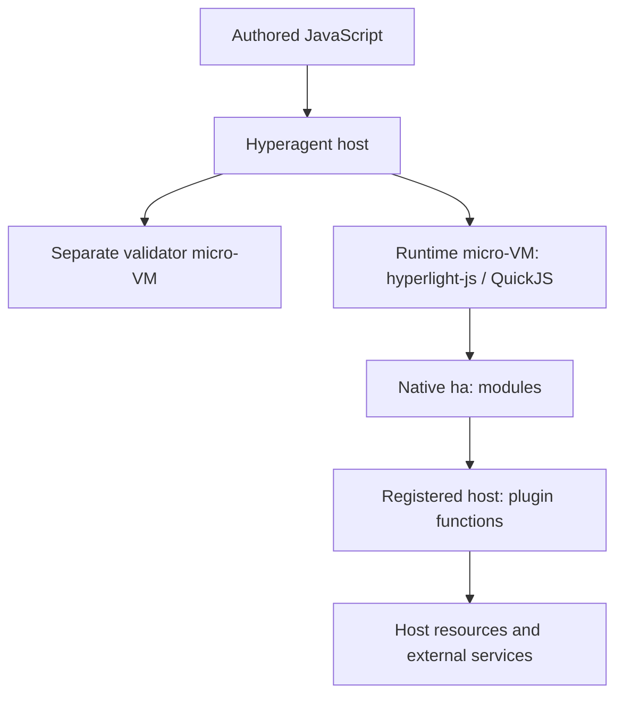

# Hyperagent sandbox review

- Status: informational
- Observations and experiments: 2026-09-29

This review separates upstream source observations from a bounded native-Rust
experiment. Versions and platform findings describe that date, not ongoing
support guarantees. The [component-generation sandbox proposal](component-generation-sandbox.md)
is a separate draft; this review does not specify or implement its integration.
The requested Wassette scope below incorporates later user clarification, not
additional experimental results.

## Summary

Two superficially similar systems solve a different problem from compilation:

- [hyperagent] runs authored JavaScript in a QuickJS-based Hyperlight guest,
  with a separate validator guest. It does not generate arbitrary WebAssembly
  components from source and a WebAssembly Interface Types (WIT) world.
- [hyperlight-sandbox]'s Wasm backend runs prebuilt interpreter components.
  Request-time scripts are data supplied to those interpreters, not inputs to a
  native compiler running inside the micro-VM.

The later 2026-09-29 experiment demonstrated a different path: native Linux
Rust compilation and component linking inside [hyperlight-unikraft], hosted on
macOS Apple silicon through Hypervisor.framework (HVF). It supersedes the
earlier research's JavaScript-first, Rust-not-in-v1 recommendation. It does not
establish a production compiler service or validate every proposed output kind.

## Hyperagent: script execution and mediated capabilities

The reviewed [hyperagent] revision uses [hyperlight-js], whose guest embeds
QuickJS. Its runtime and validator are distinct guests:



The host invokes handlers through `callHandler`. Native `ha:` modules and
registered `host:` plugin functions bridge guest code to host implementations;
those implementations remain outside the guest's isolation boundary.
The validator uses a fresh guest for each validation call. Validation is a
separate check, not a component compiler or proof of safe behavior.

The source review identified these useful patterns, with important caveats:

- **Capabilities and tool gating:** plugins define mediated operations.
  A VM boundary does not itself authorize a filesystem, network or tool call;
  the host must still decide which operations are available and permitted.
- **Approval and identity:** module-store hashing and hash-based approval tie
  decisions to code identity. An LLM audit with canaries is an additional
  screening mechanism, not a soundness guarantee or a replacement for policy.
- **Host defenses:** path-jail checks and server-side request forgery (SSRF)
  defenses protect particular plugin paths. They are not evidence that every
  extension or external service has equivalent confinement.
- **Limits:** profiles describe CPU, wall-clock, heap and scratch budgets.
  Each enforcement path needs review; a configured budget alone does not prove
  that blocking host calls are preemptible or accounted for in the same way.
- **Lifecycle:** lazy creation, handler-hash-based reuse, snapshots for timeout
  recovery and a host-side shared-state stash reduce repeated setup. Reuse and
  recovery require explicit state ownership; restoring guest memory does not
  roll back host effects.

Connected Model Context Protocol (MCP) servers are not automatically placed in
Hyperlight. Neither their processes nor arbitrary host plugin code become
sandboxed merely because a QuickJS handler calls them. The transferable lesson
is explicit mediation, not an assumption that the entire agent is in one VM.

## Hyperlight-sandbox: a fixed interpreter service

In the reviewed [hyperlight-sandbox] Wasm backend, the fixed WIT surface includes
`executor.run(code)` and `tools.dispatch(name, args-json)`. The interpreter
evaluates script text and dispatches named tool calls through the host registry.
That contract is different from accepting a newly authored component world.

The interpreter components are built ahead of requests on the build host:
Python uses `componentize-py`, JavaScript uses ComponentizeJS, and the pipeline
includes stripping and `hyperlight-wasm-aot` ahead-of-time (AOT) compilation.
This packaging work does not demonstrate request-time native compilation in a
Hyperlight guest.

The reviewed backend provides selected WebAssembly System Interface (WASI)
services rather than an unrestricted operating system. Capability-oriented
filesystem handling (`CapFs`), filesystem quotas, stubbed sockets and the host
tool registry are relevant design patterns. Stubbing guest sockets does not
prevent an authorized host tool from making network requests on its behalf.
Check defaults and allowlists for the particular backend and revision rather
than treating SDK conveniences as universal security guarantees.

Snapshot and limit machinery also needs backend-specific interpretation.
Guest interpreter state, filesystem state and host tool side effects have
different lifetimes. A restored snapshot is not a transaction over all three,
and filesystem quotas alone do not establish a total execution budget.

## Guest landscape as researched on 2026-09-29

| Project | Execution model | Native compiler fit | macOS evidence |
| --- | --- | --- | --- |
| [Core Hyperlight][hyperlight] | Minimal native guests and typed host calls; no general Linux userland | Not by itself; a compatible OS/userland layer is needed | Published `hyperlight-host` 0.17.0 has an HVF backend |
| [hyperlight-wasm] | AOT Wasm runtime; component WIT world selected when the runtime is built | Not the required native compiler environment; fixed-world contract does not accept arbitrary new worlds | Research found no macOS or aarch64 support in 0.15.0 |
| [hyperlight-js] | QuickJS handlers, without a `WebAssembly` API | Script execution, not a component compiler host | Research found no released macOS path in 0.4.0 |
| [hyperlight-unikraft] | Linux-ABI unikernel, initrd filesystem, host mounts and child processes | Native Rust demonstrated, subject to constraints below | Published 0.17.0 exercised on Apple silicon/HVF |
| [hyperlight-nanvix] | Nanvix microkernel and its own userland/toolchain | No compiler experiment established here | Not verified; research reported the project no longer actively maintained |

Core HVF support must not be generalized to every guest project. Likewise,
hyperlight-unikraft's Wasmtime image can run components without the
hyperlight-wasm fixed-world restriction, but running an existing component is
not evidence that a componentizer works in that image.

Research described Linux KVM/MSHV and Windows WHP support for unikraft.
The native compiler workflow below was not exercised on Linux or Windows
hosts. These platform observations are distinct from the verified macOS test.

## Verified native-Rust experiment

The 2026-09-29 experiment used macOS 27 on Apple silicon, HVF, and the published
`hyperlight-unikraft` 0.17.0 and `hyperlight-host` 0.17.0 crates. The guest base
was the published arm64 `python-shell` initrd with a Debian/glibc userland.
The native Linux Rust 1.98.1 `aarch64-unknown-linux-gnu` distribution,
`wasm32-wasip2` standard library, `wasm-component-ld` and `rust-lld` were baked
into the initrd. This was a native compiler in a VM, not a Wasm-hosted `rustc`.

```text
Host: WIT + wit-bindgen 0.62 + inline runtime shim + authored Rust
  -> guest source mount
  -> VM: native rustc --crate-type=staticlib
  -> VM: native wasm-component-ld --threads=1
  -> output component
  -> host validation and Wasmtime invocation
```

The host generated bindings with
`wit-bindgen rust --runtime-path crate::rt` and supplied an inline `rt` shim.
For WIT `export add: func(a: s32, b: s32) -> s32`, the result was a
**713-byte component** that passed `wasm-tools validate` and returned **42**
from `wasmtime run --invoke 'add(40, 2)'`. A `wasi:cli/run` hello-world
component also built and ran. The spike proved compilation, validation and
invocation only: it did not establish compliance with later embedded-root-name
or store admission requirements, or exercise Agent Client Protocol (ACP) layer
generation.

The reported whole build call took approximately **7.7 seconds**, with a
**429 MiB initrd** and **2 GiB scratch**. Those are measurements and settings
from this experiment, not latency guarantees, minimum requirements or capacity
limits for arbitrary source. A separate trial with the toolchain on a host
mount was substantially slower, motivating the initrd-baked toolchain.

### Constraints observed in that experiment

| Observation | Working approach |
| --- | --- |
| The ELF loader required position-independent executables (PIE) | Use the PIE Rust distribution binaries; the tested wasi-sdk clang/lld binaries were not PIE |
| `fork()` was unavailable; executable lookup could trigger an unsupported spawn path | Spawn executables by absolute path |
| `execve` from a non-main thread failed, including rustc's usual linker launch | Compile a static library, then launch the linker separately from the driver's main thread |
| The lld thread pool deadlocked under the cooperative single-vCPU scheduler | Pass `--threads=1` |
| `$ORIGIN` library lookup failed with direct `execve` | Set `LD_LIBRARY_PATH` for the compiler libraries |

These are dated compatibility findings, not permanent API guarantees. The
experiment did not exercise Cargo or procedural macros.

The process creating a macOS VM needed signing with
`com.apple.security.hypervisor`; ad-hoc signing was sufficient for the test.
The researched HVF constraint was one VM per process, motivating a signed
out-of-process builder helper for each concurrent build. A helper still needs
supervision, termination and cleanup; process separation alone supplies none
of those policies.

A separate smoke test exercised boot, an existing component, snapshot/restore
and interruption of an infinite loop using `interrupt_handle().kill()`.
That is evidence for those tested paths, not a comprehensive cancellation or
cleanup guarantee for compiler subprocesses and host callbacks.

### Work not established by the experiment

- Native compiler operation on Linux or Windows hosts remains unverified here.
- JavaScript and Python componentization remain later work. Their Wizer
  pre-initialization executes authored code and belongs inside the guest.
  Wasmtime/Wizer integration there was not verified; the stock Wasmtime image
  did not supply Wizer, and guest-specific Wasmtime configuration needs care.
- [componentize-qjs] was a researched JavaScript candidate, not the demonstrated
  compiler. Earlier recommendations for an in-process Wasmtime fallback do not
  apply to this native-Rust design.
- C/C++ needs a suitable PIE compiler/linker setup. Cargo and broader crate
  support remain later work, including the non-main-thread spawning problem.
- ACP-layer bindings are an assumption for eventual implementation to verify,
  not an output demonstrated by the original arithmetic-tool spike.

## Lessons and boundaries for Wassette

The Wassette baseline examined on 2026-09-29 used in-process Wasmtime,
per-component WASI policy and memory-only `StoreLimits`, not CPU/epoch limits.
Builder isolation does not change the execution limits of installed components.
See the existing [permission-system design](permission-system.md) for policy
context; neither this review nor the experiment changes those mechanisms.

The requested scope is generation only. Anyone may request generation, subject
to explicit capabilities and permissions: caller role is not itself authority.
Outputs may be ordinary tools or ACP layers, not ACP providers.
Installed tools execute in ordinary Wasmtime; installed ACP layers
use the existing ACP Wasmtime path. Assume bindgen support for the layer case
and verify it during implementation. No general broker-default changes follow.

The practical lessons are:

1. **Keep native compilation and linking inside hyperlight-unikraft.** Rust
   source can read compiler-visible files with `include_str!`/`include_bytes!`,
   consume resources during expansion or constant evaluation, and expose
   compiler bugs. Refuse clearly if the hypervisor is unavailable; do not fall
   back to host `rustc`. Rust-first, std-only generation excludes request-time
   Cargo, network dependency resolution, `build.rs` and procedural macros.
2. **Keep the host boundary explicit.** Pure WIT parsers, bindgen, metadata
   transforms and validators still consume untrusted input. "Does not execute
   authored code" does not mean infallible, memory-safe in every dependency,
   or immune to resource exhaustion. Bound inputs, outputs and diagnostics.
3. **Separate building from authority.** Successful compilation or validation
   does not grant installation, exposure, ACP-layer selection or invocation
   permission. Reuse the existing authorization paths rather than equating
   a generated artifact with an approved tool.
4. **Borrow mediation and lifecycle patterns, not implicit guarantees.**
   Pin the toolchain and image, minimize mounts and host functions, and
   supervise owned jobs. Treat snapshot reuse, timeouts and cleanup as behaviors
   requiring tests, especially where effects cross into the host.

The threat model still includes malicious source and WIT, hostile compiler
output, host parser defects, compiler/guest/hypervisor vulnerabilities and
overprivileged host callbacks. The experiment establishes feasibility for small
Rust examples, not resistance to adversarial workloads, cross-job isolation,
reproducibility, platform parity or production readiness.

## Source revisions

Links below pin the upstream revisions recorded for the 2026-09-29 review.
Experiment descriptions are dated observations, not upstream test guarantees.
Nanvix's maintenance assessment comes from the dated research, without a
recorded revision pin.

[hyperagent]: https://github.com/hyperlight-dev/hyperagent/tree/7ead2ee2
[hyperlight-sandbox]: https://github.com/hyperlight-dev/hyperlight-sandbox/tree/e38f49d1
[hyperlight]: https://github.com/hyperlight-dev/hyperlight/tree/b49a8498
[hyperlight-wasm]: https://github.com/hyperlight-dev/hyperlight-wasm/tree/f9491827
[hyperlight-js]: https://github.com/hyperlight-dev/hyperlight-js/tree/48f6b452
[hyperlight-unikraft]: https://github.com/hyperlight-dev/hyperlight-unikraft/tree/8f636e00
[hyperlight-nanvix]: https://github.com/hyperlight-dev/hyperlight-nanvix
[componentize-qjs]: https://github.com/andreiltd/componentize-qjs/tree/e563c6d6
